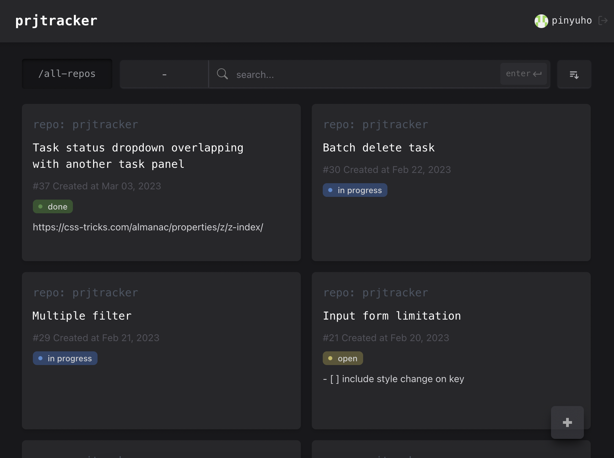
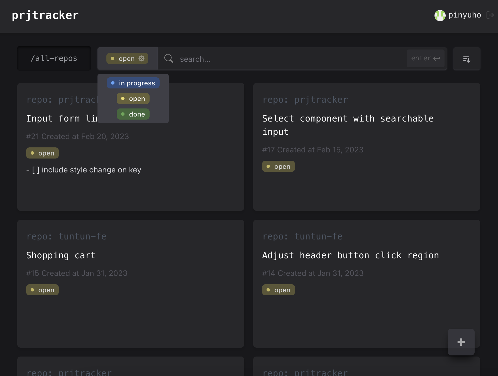
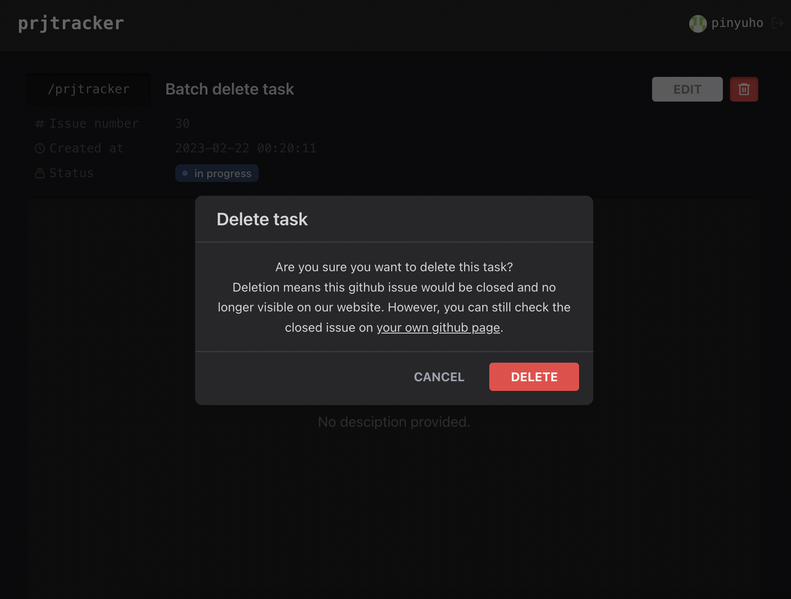

# Getting Started

## About the project

**prjtracker** is a lightweight issue-tracking app built for GitHub users.

GitHub Issues are often managed as only **Open** or **Closed**. prjtracker adds a simple workflow layer on top of GitHub Issues so that **open issues** can be tracked with extra statuses such as **Open / In-progress / Done**, like an issues-specific todo list. The UI is intentionally minimal, clean, and easy to scan.

For users managing multiple repositories at the same time, prjtracker provides an **app-repos** page that aggregates issues across repos and surfaces the most urgent ones, ranked by `created_at` (latest first).

### Key features
- Add issues
- Edit issues
- Open / Close issues
- Update workflow status: **Open / In-progress / Done**
- Filter issues by status
- Search issues by issue name
- **all-repos** page: shows urgent issues across all repos (ranked by `created_at`)

### Sync behavior
- GitHub issue open/close state is synced **on page load / refresh** (frontend fetches latest state via the backend).
- The workflow status (**Open / In-progress / Done**) is stored in **MongoDB** and does not change the GitHub issue state (issues remain **open** on GitHub unless explicitly closed).
- If an issue is deleted / removed from prjtracker, it will be **closed on GitHub**.

## Screenshots

### All repos overview


### Filter / search / status workflow


### Delete issue (also closes on GitHub)


More screenshots are available in `docs/screenshots/`.

---

## Start backend server

1. Go to the directory.

    ```bash
    cd backend
    ```

2. Copy the `.env.example` file as `.env` and change the environment variable if needed.

    ```bash
    cp .env.example .env
    ```

   Required env vars (backend):
   - `SESSION_SECRET` (generate, keep private)
     ```bash
     node -e "console.log(require('crypto').randomBytes(64).toString('hex'))"
     ```
   - `TOKEN_ENC_KEY` (**base64 of 32 bytes**, keep private)
     ```bash
     node -e "console.log(require('crypto').randomBytes(32).toString('base64'))"
     ```
   - `GITHUB_CLIENT_ID`, `GITHUB_CLIENT_SECRET`, `GITHUB_REDIRECT_URI`, `MONGO_URL`

   GitHub OAuth App:
   - Homepage URL: `"http://localhost:3000"`
   - Authorization callback URL: `"http://localhost:4000/auth/github/callback"` (must match `GITHUB_REDIRECT_URI`)

3. Install the dependencies.

    ```bash
    npm install
    ```

4. Use the Node version for this project (if using nvm).

    ```bash
    nvm use
    ```

5. Start the server.

    ```bash
    npm start
    ```

6. That's it! Now you can check the server on localhost.

---

## Start frontend server

1. Go to the directory.

    ```bash
    cd frontend
    ```

2. Copy the `.env.example` file as `.env` and change the environment variable if needed.

    ```bash
    cp .env.example .env
    ```

   Required env vars (frontend):
   - `REACT_APP_API_BASE_URL="http://localhost:4000"`

   Security note: do **NOT** put any GitHub client secret in frontend env (it will be exposed in the browser build).

3. Install the dependencies.

    ```bash
    yarn
    ```

3. Start the server.

    ```bash
    yarn start
    ```

4. That's it! Now you can check the server on localhost.

---

## Deploy backend server

1. Go to the directory.

    ```bash
    cd backend
    ```

2. Set the configuration and ensure choosing the correct target project for deploying.

    ```bash
    gcloud init
    ```

3. Deploy to GCP.

    ```bash
    gcloud app deploy
    ```

---

## Deploy frontend server

1. Go to the directory.

    ```bash
    cd frontend
    ```

2. Create a production build.

    ```bash
    yarn build
    ```

3. Set the configuration and ensure choosing the correct target project for deploying.

    ```bash
    gcloud init
    ```

4. Deploy to GCP.

    ```bash
    gcloud app deploy
    ```
